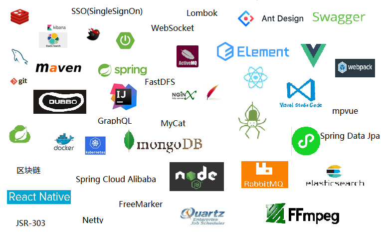

# vblog：分布式个人博客管理系统

## 一、目的
​		本项目旨在总结前后端分离常用技术点，形成集前端+后端+小程序+移动端一整套的个人技术博客解决方案。技术采用主流前后端分离微服务架构，并涵盖持续集成及自动化部署的相关解决方案。既然是以学习为目的，可能并不是以做成一个博客系统为最终目标，可能会基于此基础之上进行技术的扩充。

​		技术方面，后端采用Java技术栈，前端使用工程化的SPA单体应用实现。项目计划分为两个版本分别为vue+Spring Cloud、react+Dubbo。除了还该常用的增删改查业务之外，也会涉及高并发、限流、支付、爬虫等主流流行技术点。

​		业务方面分为后台+前台场景，后台管理系统负责对整个网站进行管理，前台为展示个人博客内容。除了实现博客的常用功能外，也希望加入秒杀、分布式搜索、区块链等功能。

​		本人才疏学浅，可能有些观点不是很成熟，考虑的没有很全面，望大家积极指正。也希望可以结识更多热爱技术的朋友，一起加油，一起进步。

## 二、主要技术：
所用到的主要技术点：

### 2.1 后端

数据库：MySql

数据访问层：Mybatis、Spring Data Jpa

NoSql：Redis、MongoDB

持续集成：docker、k8s

分布式搜索：ElasticSearch

消息队列：RabbitMQ、ActiveMQ

版本控制：git

依赖管理：maven

分布式：Spring Boot、Spring Cloud、Dubbo、Spring Cloud Alibaba

其他：Quartz、FFmpeg、Spring、maven、SSO、WebMagic、Netty等

### 2.2 前端
前端框架：Vue、React、Ant Design、Element UI

网络请求：axios、Fetch

表格图表：ECharts

数据状态管理：redux、vuex

路由管理：react-router、vue-router

小程序：mpvue

代码检查工具：ESLint

代码打包工具：webpack

## 三、主要功能
1.登录注册：实现对用户名、手机号及扫码的登录实现，实现单点登陆功能。

2.文章模块:对文章进行管理

3.分类目录：对分类目录进行管理

4.文章标签模块

5.作品管理：可添加自己的作品

6.友情链接管理

7.页面管理

8.评论管理

9.菜单管理

10.用户管理

11.网站seo设置

12.媒体资源管理：fastdfs

13.网站爬虫设计：可以抓取指定的数据到个人博客中

14.课程管理：可以发布自己的视频等课程资源，实现收费及免费功能。包括支付

15.统计模块：统计网站访问量、评论量、等信息记录网站的历程

16.搜索：分布式搜索实现对文章的搜索功能。

17.活动与招聘信息

18.吐槽与问答

19.网站数据备份与导入导出

20.数据字典管理

...

## 四、项目汇总

目前主流的技术架构采用前后端分离技术实现，在项目工程上来讲，也应是分离的项目。每个项目进行单独开发。下面是本项目中所有的工程目录。

### 4.1 版本一：

Java采用Spring Boot + Spring Cloud + Spring Data JPA  技术栈

后端项目地址：https://github.com/iquanzhan/vblog-spring-cloud

前端采用react技术栈

前端项目地址：https://github.com/iquanzhan/vblog-web-react

### 4.2 版本二：

Java采用Spring Boot + Dubbo + MyBatis 技术栈

后端项目地址：https://github.com/iquanzhan/vblog-dubbo

前端采用vue技术栈

前端项目地址：https://github.com/iquanzhan/vblog-web-vue

使用nginx+docker+k8s进行持续集成与发布管理。

## 五、工欲善其事必先利其器

java采用jdk1.8

### 5.1开发工具

#### Java开发工具配置及优化

Java端采用[IDEA](https://www.jetbrains.com/)进行开发：下载地址：https://www.jetbrains.com/

使用IDEA时有不少**优质的插件**，推荐安装：

1. **Grep console**： 支持自定义控制台不同级别的日志颜色
2.  **Free Mybatis plugin** ：根据Mapper类中方法名可直接跳转到mapper.xml
3.  **MyBatis Log Plugin** : 默认情况下MyBatis显示的脚本不是可执行的，这个插件就可以直接将Mybatis执行的sql脚本 
4.  **Alibaba Java Coding Guidelines** ：阿里巴巴代码规范检查插件
5.  **Lombok** ：利用注解的形式，省去get/set等方法
6.  **Gsonformat** ：可以根据json快速生成java实体
7.  **Restfultookit** ：主要用于调试接口，可以生成默认的数据，可根据Url快速找到对应的controller
8.  **JRebel** ：热部署插件
9.   **GenerateAllSetter** :new POJO类的时候快速生成set方法

如果其他小伙伴有更好的插件推荐，欢迎提出哦~

#### 前端开发工具配置及其优化

前端采用[VS Code](https://code.visualstudio.com)进行开发：下载地址：https://code.visualstudio.com/

为了便于开发VS Code也有不少**优质的插件**推荐：

1. **Auto Close Tag**：自动添加html的关闭标签
2. **Auto Rename Tag**：修改标签时，自动修改结束标签的名字
3.  **Beautify** ：代码美化格式化工具
4.  **Color Info** ：css中设置颜色时显示色彩信息
5.  **ESLint** ：前端规范插件，可以检查语法错误
6. **JavaScript (ES6) code snippets**：ES6语法提示
7. **Path Intellisense**：输入路径后自动补全
8. **vscode-element-helper**：element UI库的代码提示
9. **npm Intellisense**：在导包时对依赖包进行提示
10. **Reactjs code snippets**：react代码提示插件
11.  **React Redux ES6 Snippets** ：Redux代码片段工具
12.  **React-Native/React/Redux snippets for es6/es7** ：react代码片段工具
13.  **Vetur** ： Vue多功能集成插件，包括：语法高亮，智能提示，emmet，错误提示，格式化，自动补全，debugger。vscode官方钦定Vue插件，Vue开发者必备 
14.  **Bracket Pair Colorizer** ： 给括号加上不同的颜色，便于区分不同的区块，使用者可以定义不同括号类型和不同颜色 

## 六、接口规范

### 6.1前后端调试模式

本项目中所有接口，采用**restful风格**进行开发。

> 何为restful？请见：https://blog.csdn.net/x541211190/article/details/81141459

接口是后端程序员开发的，如果等待后端程序员开发完毕，再去开发前端的内容，效率是很低的。

对于前端程序员而言，其实也只是关注请求路径、参数及响应体而已，这就意味着，我们可以根据定义使用工具生成接口文档，前后端程序员按照接口文档进行开发。哪怕以后会有接口的变动也不会很大。

对于前后端联调我们采用如下模式：

​	后端：后端通过集成swagger进行接口的定义，生成接口文档，导入easy-mock中。供前端使用。后端可以根据swagger或[postman](https://www.getpostman.com)配合进行测试。

​	前端：使用接口时，利用**easy-mock**进行数据请求模拟。前端程序员按照mock模拟的请求数据进行开发。

**总体而言前后端一定是独立开发**。

### 6.2请求规范

#### 6.2.1一些约定

1.请求路径尽量采用名词形式（如user、order、article等），尽量少采用动词如（createUser、createOrder等）。

2.路径中有多个单词时使用中划线'-'来连接

3.不允许在路径中出现大写字母（参数名除外）

#### 6.2.2基本操作定义如下：

GET /users                    # 获取用户列表

GET /users/{userId}       # 查看单个的用户信息

POST /users                 # 新建一个用户

PUT /users/{userId}       # 全量更新某一个用户信息

PATCH /users/{userId}   # 选择性更新某一个用户信息

DELETE /users/{userId} # 删除某一个用户

